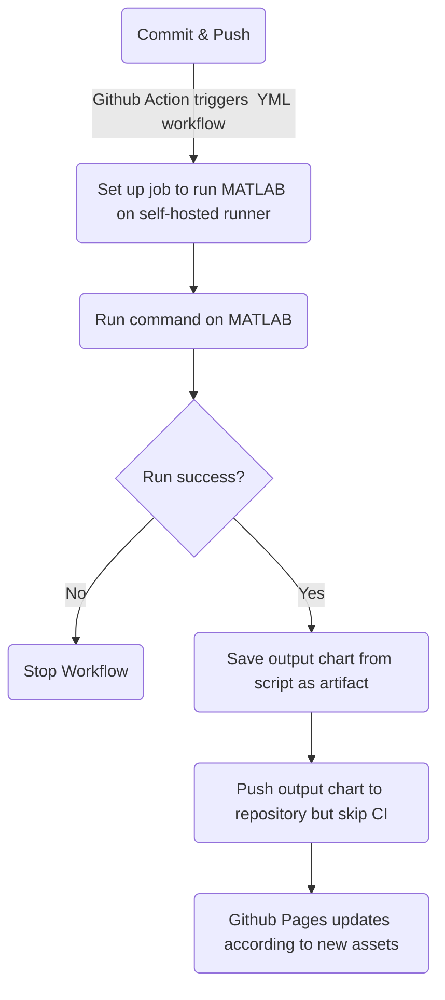

# Welcome to Ben's Stock Prediction Dashboard

The goal of this project is to make use of Github Actions for Continuous integration (CI) to update the output prediction of stock prices every time changes to the code are made and pushed them to the repo. 

You may see the output chart at the Github pages link: [https://benchiatc.github.io/devops3/](https://benchiatc.github.io/devops3/)

# Overview
Machine Learning and Artificial Intelligence are touted to be the pinnacle of predictive analytics. As higher computing power are becoming more readily available to the masses due to improve in silicon technology, so did the prevalence for the application of AI. Neural network and its variations are undoubtedly one of the most popular choices for building artificial intelligence for predictive analytics.

However, a robust and sophisticated Neural Network model requires large amount of data and time to train which could sometimes be really painful especially when having to constantly checkback on its progress. With a CI process, one can commit and push the code and let the YML handle the rest of the process while you go for a cup of coffee - with a peace of mind that the code would be deployed reliability. 

CI/CD pipeline implemented using GitHub Actions:
- Set up self-host runner. Refer to this [link](https://docs.github.com/en/actions/hosting-your-own-runners/adding-self-hosted-runners) for more details  
-   Connect to self-host runner using  the follow command in the action-runner folder (found in root folder by default)
```
$./run.cmd
```

-   Run MATLAB Command to trigger MATLAB Script
-   Save output chart from script as an artifact (can be used for troubleshooting or passed to another script as an argument)
- Pushes output chart to Github Repo which is connected to the [Github Pages](https://benchiatc.github.io/devops3/), but skip CI. This is to prevent and infinite CI loops

This pipeline is illustrated as a flow chart below.  

### CI/CD Flow diagram
